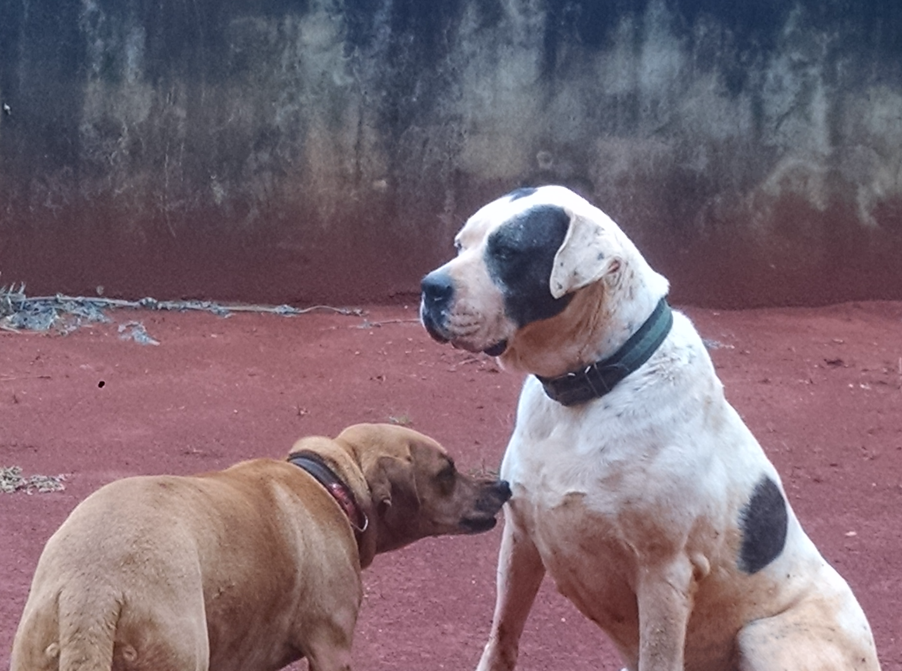

Hi there! My name is Rodrigo Masaru Ohashi. I'm a computer engineering student at the University of São Paulo.

I started this blog to share some of my thoughts with the rest of the world. I think it's a good way to start contributing with the community.

*My dogs, Mel(left) and Nani(right).*

Here, I'll write about technologies that I'm using/studing and some random stuff(like TV shows and video-games).

Nice to meet you, and feel free to contact me!
